# Architecture Documentation

This section provides a comprehensive visual overview of the system architecture, workflows, and data models.

## System Context Diagram

This diagram illustrates the EMSP platform's position within its operational ecosystem. It highlights the key external systems the platform interacts with, providing a high-level overview of its boundaries and dependencies.

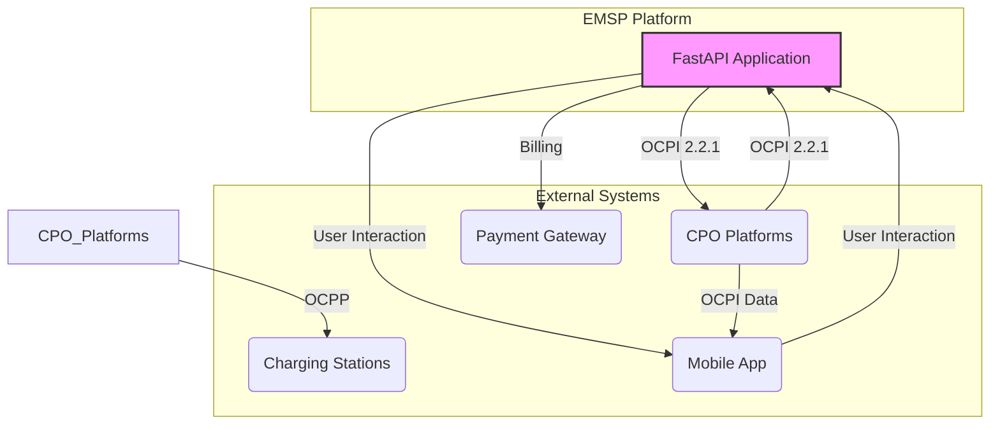

## Component Architecture Diagram

This diagram provides a detailed view of the internal components of the EMSP platform. It shows how the FastAPI application is structured and how the different layers interact.

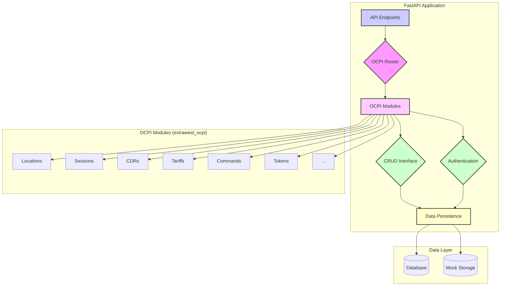

## Deployment Diagram

This diagram shows a potential deployment strategy for the EMSP platform in a production environment. It illustrates how the application components are distributed across the infrastructure.

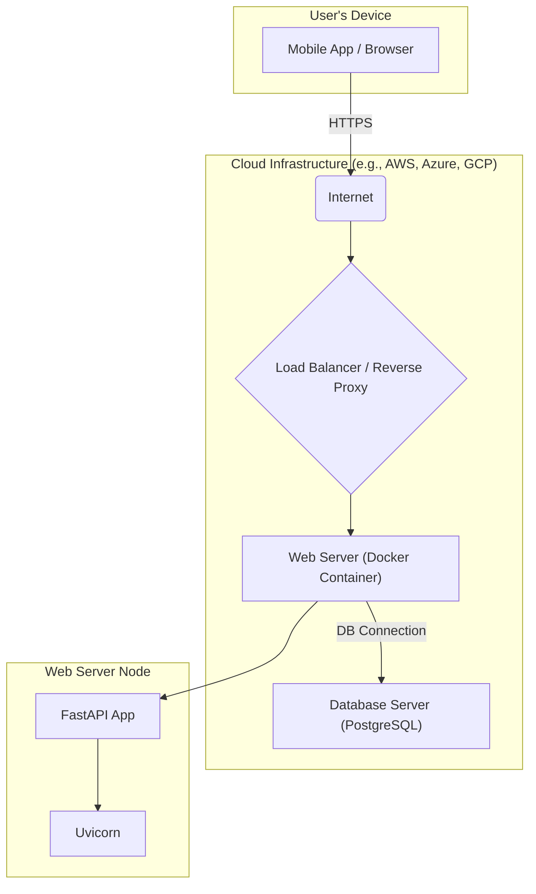

## Sequence Diagram: EMSP-CPO Authentication and Token Exchange

This diagram shows the sequence of interactions for the initial handshake and authentication between the EMSP and a CPO platform, as defined by the OCPI 2.2.1 credentials module.

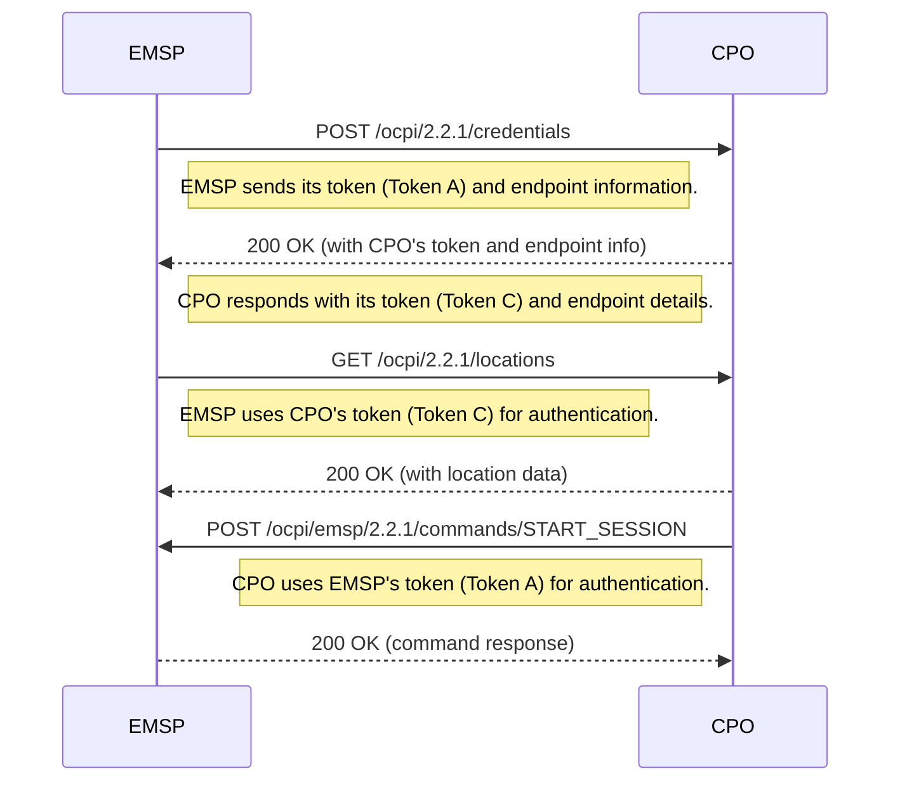

## Sequence Diagram: Location and Tariff Data Synchronization

This diagram illustrates how the EMSP synchronizes charging location and tariff data with a CPO platform. This is a fundamental process for ensuring that the EMSP has accurate information to display to its users.

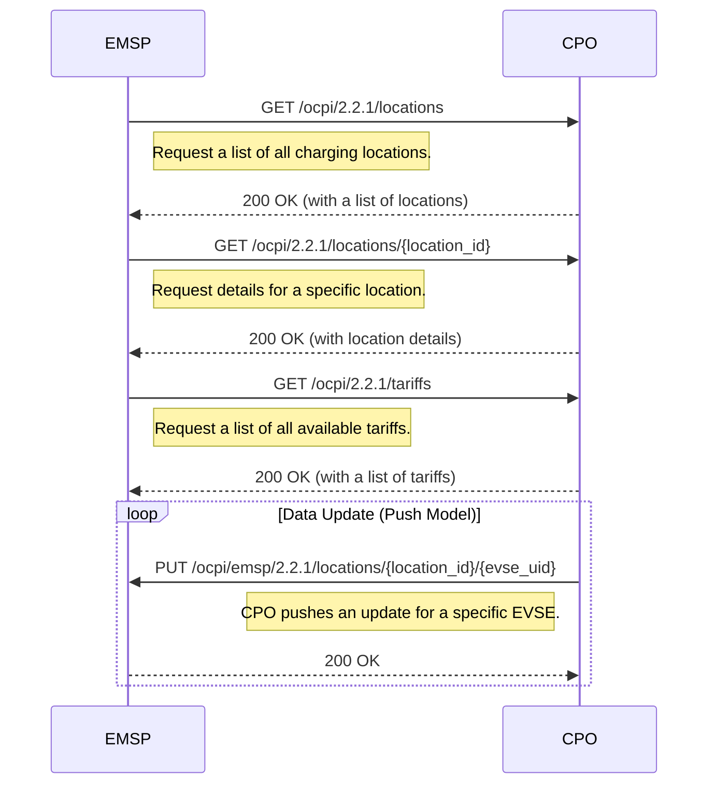

## Sequence Diagram: Charging Session Lifecycle

This diagram shows the complete lifecycle of a charging session, from initiation by the user to completion. It illustrates the roles of the User, EMSP, CPO, and the physical Charging Station.

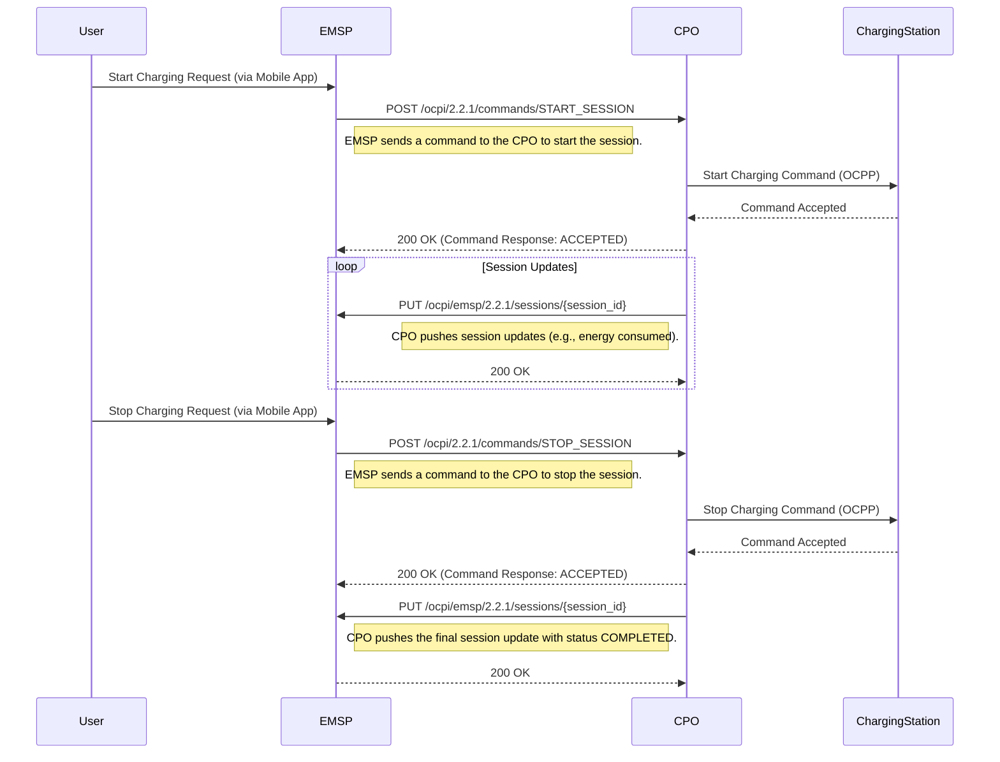

## Sequence Diagram: CDR Processing and Billing

This diagram illustrates the process of handling Charge Detail Records (CDRs) and billing the user for a completed charging session.

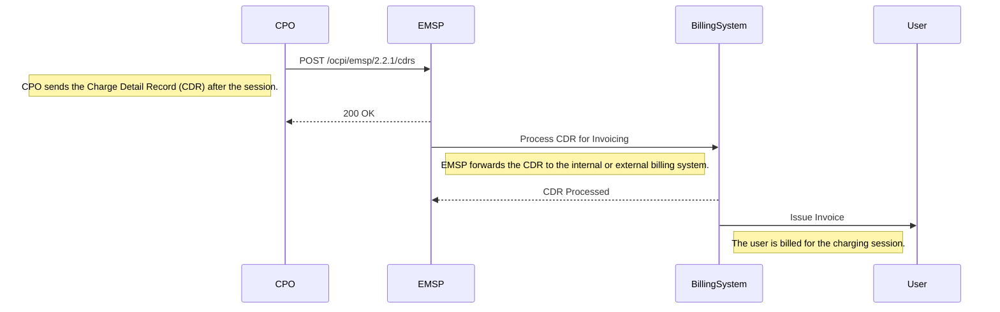

## Activity Diagram: Session Authorization

This diagram shows the business process for authorizing a charging session when a user presents their credentials (e.g., an RFID card) at a charging station.

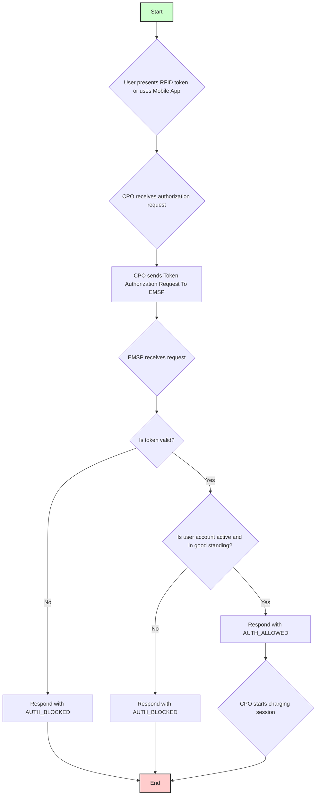

## Activity Diagram: Payment Processing

This diagram outlines the process of handling payments after a charging session is complete and a CDR has been received.

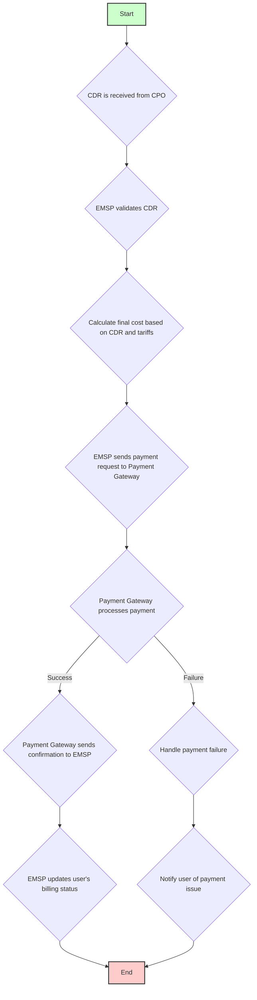

## Entity Relationship Diagram (ERD)

This diagram shows the database schema and the relationships between the main OCPI entities.

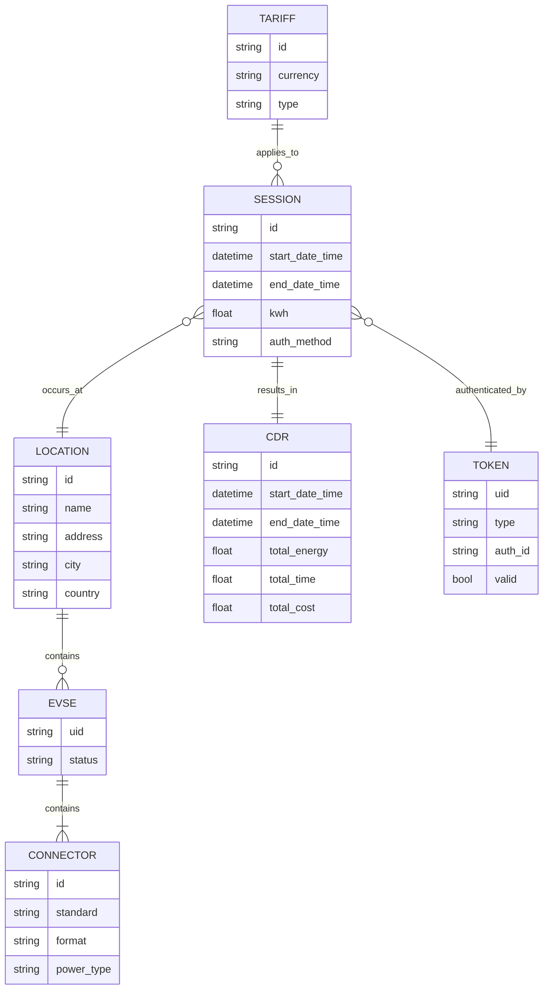

## API Interaction Diagram

This diagram shows the relationships between the main OCPI REST endpoints and how they are used for communication between the EMSP and CPO platforms.

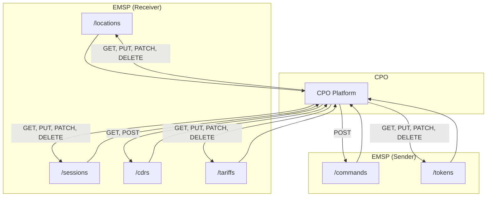

## State Transition Diagram: Charging Session States

This diagram illustrates the lifecycle of a charging session through its various states, as defined by the OCPI protocol.

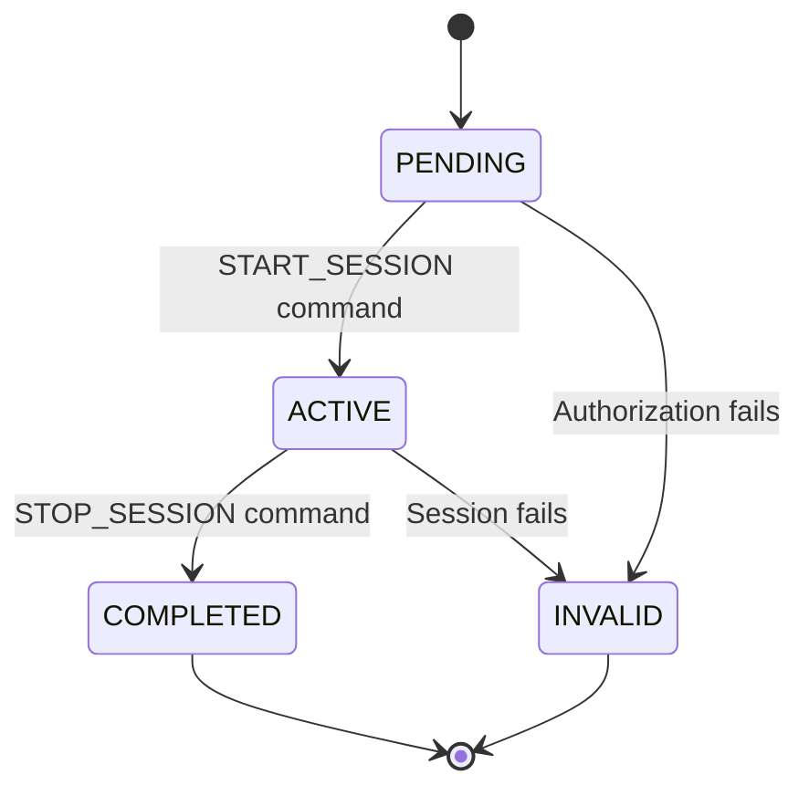

## State Transition Diagram: Connector Statuses

This diagram shows the various states that a charging connector can be in, and the events that cause it to transition from one state to another.

```mermaid
stateDiagram-v2
    [*] --> AVAILABLE
    AVAILABLE --> PREPARING: User connects EV
    PREPARING --> CHARGING: Charging starts
    CHARGING --> SUSPENDED_EVSE: EVSE pauses charging
    CHARGING --> SUSPENDED_EV: EV pauses charging
    SUSPENDED_EVSE --> CHARGING: Charging resumes
    SUSPENDED_EV --> CHARging: Charging resumes
    CHARGING --> FINISHING: Charging complete
    FINISHING --> AVAILABLE: User unplugs EV
    AVAILABLE --> UNAVAILABLE: Maintenance
    UNAVAILABLE --> AVAILABLE: Maintenance complete
    AVAILABLE --> FAULTED: Connector error
    FAULTED --> AVAILABLE: Error resolved
